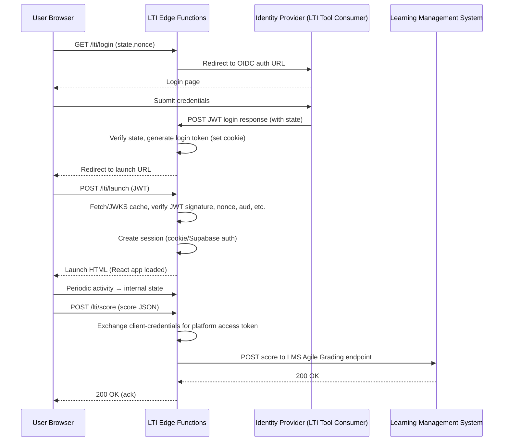
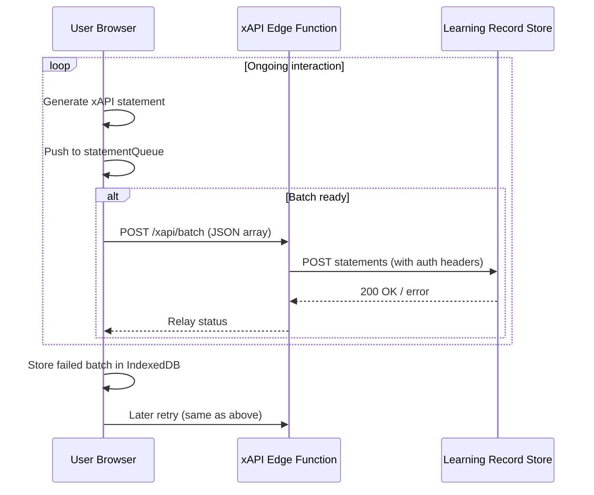

# Voix Vive – High‑Level Architecture for LTI 1.3 & xAPI Integration

## Overview
- **Frontend**: React + Vite SPA, deployed to Vercel/Netlify static hosting.
- **Backend**: Stateless serverless edge functions (Supabase Edge Functions **or** Netlify Functions).
- **Data store**: Supabase Postgres (for user profiles, course data) + Supabase KV / in‑memory cache for short‑lived LTI nonces & state.
- **Security**: All secrets (LTI private key, xAPI token, OAuth client credentials) kept as environment variables; edge functions run in a isolated V8 sandbox.

---

## 1. LTI 1.3 – Minimal Backend

### Responsibilities
| Function | Purpose |
|----------|---------|
| **`/lti/login`** (GET) | Initiates OIDC login: generates `state` & `nonce`, builds auth request URL, redirects to IdP. |
| **`/lti/launch`** (POST) | Receives LTI launch JWT, validates signature/nonce/state, extracts user/context claims, creates a session (encrypted cookie or Supabase auth token), returns launch HTML. |
| **`/lti/jwks`** (GET) | Exposes the platform’s public JWKS (cached from the tool consumer). |
| **`/lti/score`** (POST) | Implements the Agile Grading Service: receives a score payload, obtains an OAuth 2 client‑credentials token for the platform, POSTs to the platform’s `score` endpoint. |

### Flow (Mermaid)



### Minimal Requirements
- **Node.js runtime** (≥18) with `node-jose` for JWT verification and `jose` for JWKS handling.
- **Supabase/KV** (or a simple in‑memory Map) to store `state`/`nonce` for the duration of the login flow (< 2 min).
- **Environment variables**:
  - `LTI_PRIVATE_KEY` (PEM)
  - `LTI_PUBLIC_JWKS_URL` (or static JWKS JSON)
  - `LTI_CLIENT_ID`, `LTI_DEPLOYMENT_ID`
  - `SCORE_SERVICE_URL` (LMS endpoint)
  - `OAUTH_CLIENT_ID`, `OAUTH_CLIENT_SECRET` (for token exchange)

All of these can be set in Supabase Secrets or Netlify Site Settings; no persistent server is required.

---

## 2. xAPI Statement Handling

### Client‑Side Batching Strategy
1. **Collect** statements in an array (`statementQueue`) as they occur (e.g., `completed exercise`, `watched video`).
2. **Flush** when either:
   - `statementQueue.length ≥ BATCH_SIZE` (default 20), **or**
   - `timeSinceLastFlush ≥ FLUSH_INTERVAL` (default 5 s).
3. **Send** a `POST` request to `/xapi/batch` with JSON body `{ "statements": [...] }`.
4. On **failure**, store the batch in IndexedDB (`xapi‑pending`) and retry on next flush or via `navigator.sendBeacon`/`background sync`.

### Edge Function Proxy (`/xapi/batch`)
- Verifies incoming request originates from authenticated Voix Vive session (cookie/Supabase auth).
- Adds required xAPI headers:
  - `Authorization: Bearer <XAPI_TOKEN>` (from env)
  - `Content-Type: application/json`
  - `X-Experience-API-Version: 1.0.3`
- Forwards the JSON array to the configured LRS endpoint (`https://lrs.example.com/xapi/statements`).
- Returns `200` if LRS accepts; otherwise relays LRS error (so client can retry).

### Flow (Mermaid)



### Implementation Notes
- **Batch size & interval** are configurable via env (`XAPI_BATCH_SIZE`, `XAPI_FLUSH_INTERVAL`).
- The edge function can be written in **TypeScript** using the native `fetch` API; no extra dependencies needed.
- For Supabase Edge Functions, use the default Deno runtime; for Netlify Functions, use Node.js.
- No persistent DB is required for xAPI unless you want to store failed batches long‑term; IndexedDB suffices for transient offline scenarios.

---

## 3. Deployment Diagram (Textual)

```
+-------------------+        +----------------------+        +---------------------+
|   Vercel / Netlify| static |   Edge Functions     | <--->  | Supabase (Postgres) |
|   (React SPA)    |<------>| (LTI & xAPI proxies)|        |   (auth, KV, DB)    |
+-------------------+        +----------------------+        +---------------------+
          ^                           ^                         ^
          |                           |                         |
          |                           v                         v
          |                 +------------------+        +------------------+
          |                 |   LTI Tool       |        |   LRS (xAPI)     |
          |                 |   Consumer (LMS) |        |   (Learning      |
          |                 +------------------+        |   Record Store)  |
          |                                             +------------------+
          +---------------------------------------------+
                         (HTTPS / WSS)
```

All communication is HTTPS; JWTs and OAuth tokens are signed/encrypted as per spec.

---

## 4. Recommendation Summary

- **Serverless feasible**: Yes – both LTI 1.3 launch/score and xAPI batching can be implemented as stateless edge functions.
- **Minimal LTI backend**: Four endpoints (`/lti/login`, `/lti/launch`, `/lti/jwks`, `/lti/score`) with JWT verification, nonce/state caching, and OAuth 2 token exchange for grade pass‑back.
- **xAPI batching**: Client‑side buffering → periodic POST to edge function proxy → forward to LRS with auth headers; fallback to IndexedDB for offline resilience.

This architecture keeps operational complexity low, scales automatically with traffic, and leverages the existing Supabase/Netlify ecosystem for secrets, KV storage, and optional persistence.
