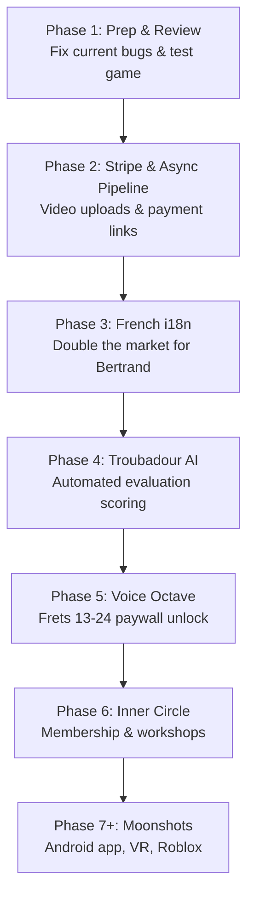

# Voix Vive — Multi-Phase Development Implementation Plan

## Goal Description
We are pair-programming to systematically build and launch **Voix Vive**, a somatic guitar and voice mentorship platform for Master Guitarist Bertrand Laurence. The roadmap is designed around a **"Slow Web," anti-dopamine, somatic-first pedagogy** to provide high-quality education, build trust via a free "Living Textbook," and unlock sustainable, revenue-first coaching services to fund Bertrand's dream trip to France.

Our goal today is to look at `ROADMAP.md` and `CONTEXT.md` to map out exactly how we will progress through all phases of development, beginning with our immediate Phase 1 milestone (stakeholder review preparation) and detailing the upcoming execution steps for Phases 2 through 6+.

---

## Current Status Overview
* **Phase 0 (Foundation):** **100% Complete.** 12-chapter curriculum, swipeable slide viewer, business landing page (StudioPage), local IndexedDB practice recorder, bottom navigation, and base SEO are all functional.
* **Phase 1.5 & 1.6 (Guitar Tools):** **100% Complete.** 12/12 fretboard tools are fully built, wired, and interactive inside the Digital Binder (e.g., Breathing Gate, PlingTrainer, PitchRoom, Interval Visualizer, Microtonal Tracker, and the Vertiscale Engine game on Fret 9).
* **Phase 1 (Stakeholder Review):** **In Progress (Target: Thursday, May 22).** We are preparing the platform for a live, mobile-first sync with Bertrand.

---

## Proposed Phase-by-Phase Execution Plan

### Phase 1: Stakeholder Review Prep (Current — May 19-22)
* **Goal:** Hardened, bug-free prototype ready for Bertrand's phone review.
* **Key Tasks:**
  1. Run the local dev server and conduct comprehensive end-to-end browser testing of all 12 fretboard tools.
  2. Verify all three game modes of the **Fret 9 Vertiscale Engine** (Flash, Imagine, and Audiate) to guarantee zero runtime crashes.
  3. Ensure layout constraints are optimized for mobile viewports (e.g., maximum-width containers on desktop so fretboards do not stretch excessively).

### Phase 2: Stripe & Async Coaching Pipeline (Week 2 — May 25-31)
* **Goal:** Earn the first dollar by setting up asynchronous coaching video feedback.
* **Key Tasks:**
  1. Purchase and configure the `voix-vive.com` custom domain in Vercel settings and Squarespace DNS.
  2. Integrate Stripe payment link placeholders in `pricingData.js`.
  3. Extend `PracticeRecorder` to upload captured video/audio files to a live remote storage (e.g., Cloudflare R2 Workers).
  4. Create a student submission inbox and feedback recording dashboard for Bertrand.

### Phase 3: French Internationalization (Week 3 — June 1-7)
* **Goal:** Reach French and Canadian markets by localizing the platform.
* **Key Tasks:**
  1. Install `react-i18next` and establish the translation provider.
  2. Extract raw text strings from UI chrome and slides into `locales/en.json`.
  3. Formulate `locales/fr.json` translations.
  4. Integrate a clean language toggle (🇺🇸 / 🇫🇷) into the top header.

### Phase 4: Troubadour AI Evaluation (Week 4-5 — June 8-21)
* **Goal:** Deliver an automated, zero-marginal-cost revenue stream using Web Audio pitch analysis.
* **Key Tasks:**
  1. Create a `ToneAnalyzer.js` to classify vocal tone via MFCC parameters.
  2. Implement `BreathDetector.js` to measure breath support and tracking.
  3. Build `TroubadourScorecard.jsx` to render pitch/rhythm/tone/breath indicators on a radar chart *without* punitive gamification.
  4. Scaffold $5 (Bronze), $15 (Silver), and $35 (Gold) AI evaluation tiers.

### Phase 5: Voice Octave — Frets 13-24 (Week 6-7 — June 22 - July 5)
* **Goal:** Premium paywalled curriculum completing the "Voix Vive" vocal promise.
* **Key Tasks:**
  1. Design and populate the 12 somatic voice slides (Frets 13-24) based on Bertrand's dual-coding (Inner Voice vs. Outer Voice) principles.
  2. Embed a paywall gate at Fret 13 requiring a one-time Stripe payment ($49) or membership check.
  3. Expand `chapterData.js` to dynamically load the second octave.

### Phase 6: Inner Circle Community & Workshops (Week 8 — July 6-12)
* **Goal:** High-fidelity membership subscription ($25/mo) and paid live workshops.
* **Key Tasks:**
  1. Wire Stripe recurring customer billing.
  2. Design member priority queues and downloadable materials tabs inside the Digital Binder.
  3. Embed workshop schedules with Zoom registration deep links.

---

## User Review Required

> [!IMPORTANT]
> **Priority Check:** Do you want to begin with **Phase 1: Live Testing & Bug Fixes** (Workflow 1 in `CONTEXT.md`) to verify the existing 12 tools and Fret 9 game in the browser first? Or should we immediately prepare the DNS/Vercel and Stripe scaffolding for **Phase 2**?

> [!WARNING]
> **Pedagogical Boundary:** Standard e-learning apps reward speed and constant streaks. To preserve Bertrand's "Slow Web" philosophy, we must never display speed scores, timer pressure, or competitive leaderboards. We will measure progress purely by presence, breath stability, and spatial consistency.

---

## Open Questions
1. **Domain Setup:** Have you already purchased the domain `voix-vive.com` on Squarespace, or do you want me to assist in checking DNS/domain availability?
2. **Backing Track Files:** The app currently loads Bertrand's "Houlton Skies" ambient track (`houlton_skies.m4a`). Do you have any additional high-fidelity audio assets you'd like loaded for subsequent tools?
3. **Stripe Payment Links:** Bertrand will generate these himself. For Phase 2, should we scaffold simple placeholder payment URLs in `pricingData.js` so they can be easily swapped?

---

## Verification Plan

### Automated & Built-in Verification
* Run `npm run build` locally to verify that all React components, routes, and hooks compile correctly.
* Inspect console logs during dev server launch to watch for any Web Audio API initialization errors or duplicate AudioContext warnings.

### Manual Verification (Browser)
* Use the **Browser Subagent** to open the local development environment (`localhost:5173`).
* Walk through:
  1. Landing Page -> Onboarding Slider -> Chapter Portals.
  2. Digital Binder -> Tools Grid -> Breathing Gate and PlingTrainer.
  3. Fret 9 Game -> Flash and Imagine modes.
* Review layout scaling on simulated mobile viewports.
