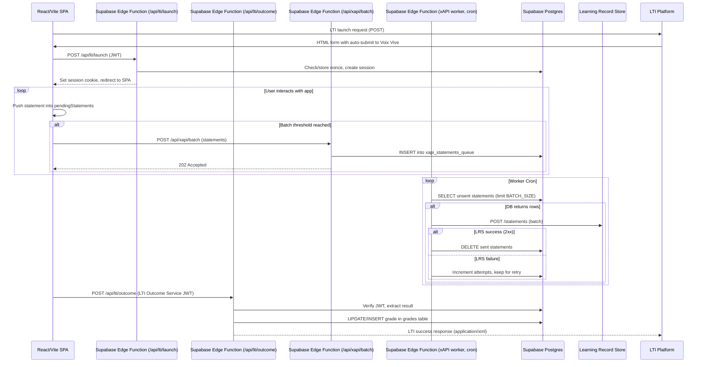

# Voix Vive – xAPI & LTI 1.3 Integration Architecture  
**File:** `ARCHITECTURE.md`

```markdown
# Voix Vive – xAPI & LTI 1.3 Integration Architecture

## 1. High‑level Overview
Voix Vive is a React/Vite single‑page application (SPA) that runs in the browser.
Integration points:

| Integration | Direction | Primary Purpose |
|-------------|-----------|-----------------|
| **LTI 1.3 Launch** | LMS → Voix Vive (frontend via POST) | Authenticate user, establish session, retrieve LTI context (user ID, course ID, roles). |
| **Outcome Service (Grade Passback)** | Voix Vive → LMS (HTTPS POST) | Send graded activity results back to the LMS gradebook. |
| **xAPI Statements** | Voix Vive (frontend) → LRS (via backend batch) | Record learner interactions for analytics and reporting. |

All server‑side logic can be implemented as **stateless, serverless functions** (Supabase Edge Functions or Netlify Functions) backed by a lightweight PostgreSQL/Supabase database for persistence of nonces, user sessions, grades, and queued xAPI statements.

---

## 2. Can This Be Serverless?
**Yes.**  
Both LTI 1.3 launch/validation and grade passback involve only:

* JWT signature verification (using the LMS’s public key).  
* Nonce/replay attack mitigation (store used nonces briefly).  
* Simple CRUD operations (create session, read/write grades, queue statements).

These operations fit the serverless model perfectly. Supabase Edge Functions (or Netlify Functions) provide:

* Automatic HTTPS endpoints.  
* Built‑in access to Supabase PostgreSQL via the `@supabase/supabase-js` client.  
* Optional KV‑style storage (Supabase `realtime` or a short‑lived `lti_nonces` table) for nonce tracking.  
* Scheduled/cron‑like execution (via Supabase Functions schedule or Netlify Background Functions) for batch xAPI forwarding.

Thus, no always‑on VM or container is required; the system scales to zero when idle.

---

## 3. Minimal Backend Needed for LTI 1.3 Launch & Grade Passback

### 3.1 Core Endpoints (Serverless Functions)

| Function | HTTP Method | Path | Responsibility |
|----------|-------------|------|-----------------|
| `lti-launch` | `POST` | `/api/lti/launch` | Validate LTI 1.3 launch JWT, check nonce, create a Voix Vive session (cookie or token), return HTML/redirect to SPA. |
| `lti-outcome` | `POST` | `/api/lti/outcome` | Verify Outcome Service request (JWT/OAuth signature), extract result, store/update grade in `grades` table, respond with LTI success XML/JSON. |

### 3.2 Required Persistent Stores

| Table / Store | Purpose | TTL / Retention |
|---------------|---------|-----------------|
| `lti_nonces` (table) | Store used nonces to prevent replay attacks. | Auto‑expire after LTI‑specified validity window (e.g., 5 min). Supabase can use a `created_at` column + a periodic cleanup function or a simple `DELETE WHERE now() - created_at > interval '5 minutes'`. |
| `sessions` (table) | Map session ID → LTI user/sub, course/context IDs, issued‑at timestamp. | Expire after idle timeout (e.g., 30 min). Can be cleaned by a scheduled function or rely on JWT expiry if using signed session cookies. |
| `grades` (table) | Store per‑activity scores for possible re‑submission or audit. | Retain indefinitely or per institutional policy. |
| `xapi_statements_queue` (table) | Buffer xAPI statements before batch forwarding to LRS. | Delete after successful send; retain on failure with retry count. |

### 3.3 Security Essentials

* **LTI 1.3 Public Key** – fetched once at cold‑start from the JWKS URL supplied by the LMS and cached in memory for the function’s lifetime.
* **JWT Validation** – verify `iss`, `aud`, `exp`, `nonce`, and optionally `azp` using the LTI platform’s client ID.
* **Nonce Store** – essential for replay protection; a simple unique‑constraint table works fine.
* **Outcome Service Auth** – verify the JWT signature (same key set) and ensure the `result` matches the expected `sourcedId`.
* **Environment Variables** – store LMS client IDs, public key JWKS URL, Supabase anon/service_role keys, LRS endpoint & auth token.

---

## 4. xAPI Statement Batching / Sending Strategy

### 4.1 Client‑Side Collection
* The React app maintains an in‑memory array `pendingStatements`.
* Whenever a trackable interaction occurs (e.g., chord practice completed, video watched), push a properly formed xAPI statement (per ADL spec) into the array.
* When **either**:
  * `pendingStatements.length >= BATCH_SIZE` (e.g., 20), **or**
  * `timeSinceLastSend >= BATCH_INTERVAL` (e.g., 30 seconds),
  trigger a flush.

### 4.2 Flush Mechanism
* Send a `POST` request to the Voix Vive backend endpoint `/api/xapi/batch`.
* Payload: `{ statements: [ … ] }`.

### 4.3 Backend Batch Function (`/api/xapi/batch`)
1. **Auth** – verify request originates from the authenticated Voix Vive session (session cookie or JWT).  
2. **Persist** – insert each statement into `xapi_statements_queue` with columns: `id`, `statement_json`, `attempts`, `created_at`.  
3. **Acknowledge** – respond `202 Accepted` immediately to the client (so UI stays responsive).  

### 4.4 Asynchronous Forwarding Worker
* A **Supabase Edge Function scheduled** (cron‑like) runs every minute (or uses a database trigger + pg_notify + listener if preferred).
* The worker:
  * SELECTs unsent statements (`attempts < MAX_RETRY`) ordered by `created_at` LIMIT `BATCH_SIZE`.
  * For each batch:
    * POST to the configured LRS endpoint (`/statements`) with headers:
      * `Authorization: Bearer <LRS_TOKEN>`
      * `Content-Type: application/json`
      * `X-Experience-API-Version: 2.0.0`
    * Body: `{ "statements": [ … ] }` (xAPI allows batch array).
  * On **success** (`2xx`):
    * DELETE the sent statements from the queue.
  * On **failure**:
    * Increment `attempts`.
    * If `attempts >= MAX_RETRY`, move to a dead‑letter table or alert admin.
* This decouples client latency from LRS availability and provides built‑in retry.

### 4.5 Alternative: Direct Client‑to‑LRS (if CORS permits)
If the LRS exposes a CORS‑enabled endpoint and you can safely embed the token (e.g., using short‑lived token via Voix Vive auth), you could skip the backend batch step. However, storing the token client‑side is less secure; the serverless batch approach keeps secrets off the frontend.

---

## 5. Recommended Architecture Diagram (Mermaid)



---

## 6. Summary Recommendation

* **Serverless Viability:** Fully achievable with Supabase Edge Functions (or Netlify Functions). No always‑on servers needed; scale‑to‑zero keeps cost low.
* **Minimal Backend:** Two core LTI endpoints (`/api/lti/launch`, `/api/lti/outcome`) backed by:
  * a short‑lived nonce table,
  * a sessions table,
  * a grades table,
  * optional caching of the LMS public key.
* **xAPI Handling:**  
  - Client buffers statements and flushes to a `/api/xapi/batch` edge function.  
  - The function persists them to a queue table.  
  - A scheduled worker edge function reads the queue, batches, and forwards to the LRS with secure auth token, providing retry and dead‑letter handling.
* **Operational Benefits:**  
  * Secrets (LRS token, service keys) stay in the environment of the edge functions—never exposed to the browser.  
  * All state is stored in PostgreSQL, giving you auditability and the ability to query usage analytics directly from the DB if desired.  
  * Adding more LTI services (e.g., Names & Role Provisioning) or additional xAPI verbs follows the same pattern.

Implementing the above will give Voix Vive a secure, scalable, and maintainable foundation for both LTI 1.3 integration and xAPI‑based learning analytics while staying fully serverless.